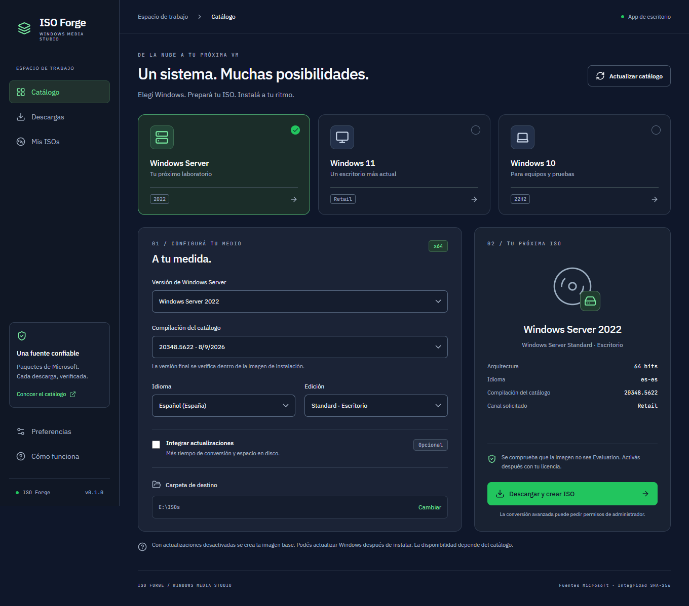

# ISO Forge

Una app de escritorio para descargar paquetes de Windows desde Microsoft y convertirlos en una ISO instalable. Interfaz en español, descarga reanudable y verificación SHA-256.



## Descargar y usar

Descargá **ISO-Forge-0.1.0-Windows-x64.exe** desde [Releases](https://github.com/GonzaCass/iso-forge/releases). Es portable: no necesitás instalar Node, Python ni Fido.

Esta primera versión no tiene firma digital de editor.

1. Elegí Windows Server, Windows 11 o Windows 10.
2. Seleccioná compilación, idioma y edición disponibles en el catálogo.
3. Elegí una carpeta con espacio libre. Calculá al menos 30–40 GiB para paquetes, medio temporal y verificaciones; algunas compilaciones requieren más.
4. Presioná **Descargar y crear ISO**. Para conversiones avanzadas, aceptá el permiso de administrador de Windows.
5. Abrí **Mis ISOs** para encontrar el archivo terminado, la versión real de la imagen y su SHA-256.

Se solicita el canal **Retail** y se rechazan ediciones Evaluation tanto en el catálogo como en los metadatos de la imagen. La app no incluye licencias, claves ni activadores. Activá después la edición instalada con una licencia compatible.

## Disponibilidad y alcance

- Catálogo x64 de Windows 10, Windows 11, Server 2022, Server 2025 y Server 2019, sujeto a disponibilidad de UUP dump y Microsoft.
- No cubre todas las versiones históricas, medios OEM ni portales privados de licencias por volumen.
- Se construye una ISO local a partir de UUP. No se promete una ISO idéntica byte por byte a la de un portal de licencias.
- Una compilación del catálogo puede incluir actualizaciones separadas. Con **Integrar actualizaciones** desactivado se obtiene la imagen base; la biblioteca muestra la versión leída de la imagen final.
- Las compilaciones antiguas que carezcan de SHA-256 o de paquetes completos se rechazan con un error.
- Los servidores se seleccionan según producto; algunas versiones pueden quedar sin resultados.

## Cómo funciona

El proceso principal consulta la API HTTPS de UUP dump y valida producto, canal, edición, nombres, tamaños y SHA-256. Descarga los paquetes desde una lista limitada de hosts de Microsoft. Algunos enlaces oficiales de Microsoft Update utilizan HTTP: su integridad se comprueba contra el SHA-256 obtenido del catálogo HTTPS; no se desactiva la validación de certificados.

La primera conversión descarga una versión fijada de [UUP converter de abbodi1406](https://github.com/abbodi1406/BatUtil/tree/master/uup-converter-wimlib). El archivo de herramientas se verifica con SHA-256 y se guarda fuera del programa. Los binarios de Microsoft y otras herramientas no se redistribuyen en este repositorio.

**Server 2022 Standard con escritorio**, sin actualizaciones y con un ESD completo compatible, tiene una conversión de archivos que usa wimlib y las herramientas de preparación del medio sin elevar permisos. El resto usa el conversor UUP, que puede requerir administrador y DISM. Durante conversión y verificación no se permite pausar: se puede pausar durante la descarga y reanudar seleccionando el mismo conjunto y destino.

La verificación final comprueba la imagen instalada, la edición, la integridad WIM y las entradas BIOS/UEFI, y calcula el SHA-256 de la ISO. **No realiza un arranque ni una instalación de Windows en una VM.**

Se conservan los paquetes y el medio temporal en una subcarpeta propia. No se borran los instaladores del usuario. Las preferencias, herramientas e historial viven en la carpeta de datos de ISO Forge del perfil de Windows.

## Desarrollar

Requisitos: Windows x64, Node.js 24 y npm. Microsoft Edge para las pruebas visuales.

```powershell
npm ci
npm run desktop
```

```powershell
npm test
npm run build
npm run test:ui
node scripts/smoke-desktop.mjs
npm run package:win
```

El ejecutable queda en `release/`. `npm run dev` abre únicamente la vista previa web; la descarga funciona en la app Electron.

## Diseño

Dirección visual basada en [UI/UX Pro Max](https://github.com/nextlevelbuilder/ui-ux-pro-max-skill): Dark Mode (OLED), referencias de dashboard y Bento Grid, IBM Plex Sans + JetBrains Mono. Fuentes locales, iconos Lucide, foco visible, formularios etiquetados y adaptación a pantallas pequeñas. Las decisiones están documentadas en `design-system/iso-forge/`.

## Estado de validación

Ver [VALIDATION.md](docs/VALIDATION.md). La conversión de Server 2022 Standard se prueba con un paquete real de Microsoft. Las otras versiones usan el conversor upstream y aún requieren pruebas de instalación completas; no se afirma que se haya instalado cada edición soportada por el catálogo.

## Licencia

El código propio de ISO Forge es MIT. Windows y las herramientas externas conservan sus licencias respectivas. Ver [THIRD_PARTY.md](docs/THIRD_PARTY.md).
